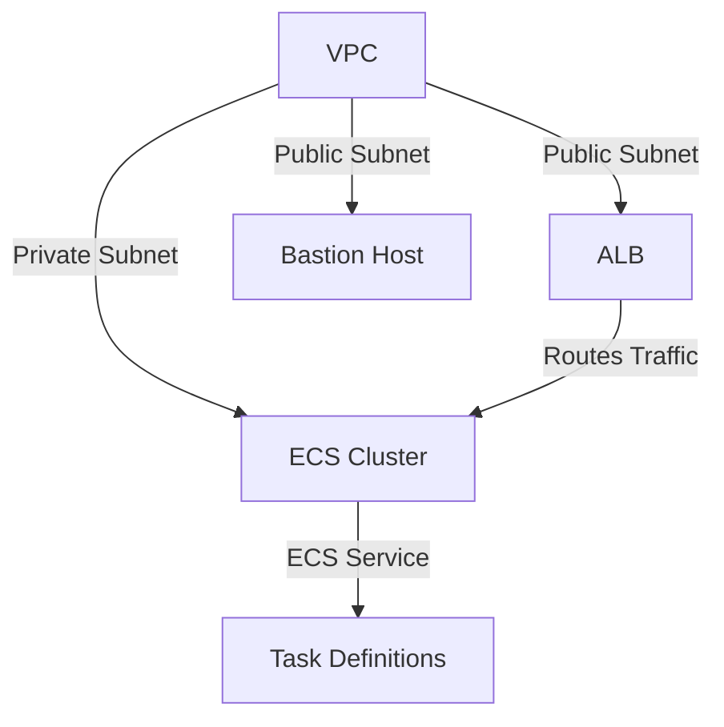

# ECS-ALB Infrastructure Project

 

## 📜 Overview
This project provisions a scalable and secure infrastructure on AWS using Terraform. It includes the following components:

- **Elastic Container Service (ECS)** for container orchestration.
- **Application Load Balancer (ALB)** for traffic distribution.
- **Virtual Private Cloud (VPC)** for network isolation.
- **Bastion Host** for secure access.
- **Security Groups** for fine-grained access control.

## 🏗️ Architecture

The architecture consists of the following key components:

- **VPC**: A custom VPC with public and private subnets.
- **ALB**: An Application Load Balancer to route traffic to ECS services.
- **ECS**: A cluster running containerized applications.
- **Bastion Host**: A secure entry point for administrative access.

### Diagram



## 🔄 Workflow

1. **Terraform Modules**:
   - **VPC Module**: Provisions the VPC, subnets, and route tables.
   - **ALB Module**: Sets up the Application Load Balancer.
   - **ECS Module**: Configures the ECS cluster and services.
   - **Security Groups Module**: Manages security group rules.
   - **Bastion Module**: Deploys the bastion host.

2. **Execution Steps**:
   - Initialize Terraform: `terraform init`
   - Plan the infrastructure: `terraform plan`
   - Apply the configuration: `terraform apply`

## 📂 Project Structure

```plaintext
infra-ecs.plan
main.tf
outputs.tf
provider.tf
terraform.tfvars
variables.tf
versions.tf
modules/
    alb/
    bastion/
    ecs/
    security_groups/
    vpc/
scripts/
    bastion_userdata.sh
```

## 📘 Documentation

- **Prompt-Doc-for-ECS.docx**: Detailed documentation for the ECS setup.

## 🛠️ Prerequisites

- Terraform v1.0+
- AWS CLI configured with appropriate credentials
- SSH key pair for bastion host access

## 🚀 Getting Started

1. Clone the repository:
   ```bash
   git clone <repository-url>
   ```
2. Navigate to the project directory:
   ```bash
   cd ecs-alb-infra
   ```
3. Update `terraform.tfvars` with your configuration.
4. Deploy the infrastructure:
   ```bash
   terraform apply
   ```

## 🤝 Contributing

Contributions are welcome! Please fork the repository and submit a pull request.

## 📄 License

This project is licensed under the MIT License.

---

Made with ❤️ by [Your Name]